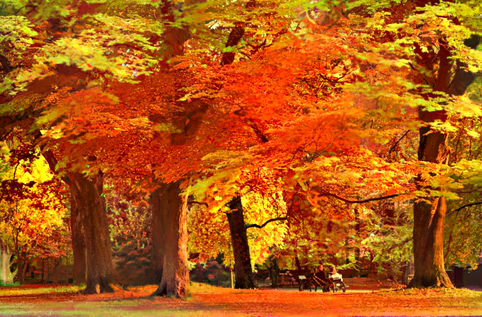

# Photorealistic-Deep-Photo-Transfer

Fork from [deep-photo-styletransfer](https://github.com/luanfujun/deep-photo-styletransfer) by fujunluan.

## Modifications
Remove the dependency of Matlab. This demo can be implemented based on __Octave__ and __Torch__. 

## Instructions
### Installation
- Install `Octave`
```
sudo apt-get install octave
sudo apt-get install octave-control octave-image octave-io octave-optim octave-signal octave-statistics

```

- Install `Torch`
```
git clone https://github.com/torch/distro.git ~/torch --recursive
cd ~/torch; 
bash install-deps; # maybe skip 
./install.sh
sudo apt-get install libmatio2
luarocks install matio
luarocks install loadcaffe
```

- Download pre-trained `VGG-19` model
```
sh models/download_models.sh
```

- Compile `cuda_utils.cu` (Modify the first two lines `PREFIX` and `NVCC_PREFIX` in `makefile`, then make it)
```
make clean && make
```

### Running

- You have to prepare four kinds of `.png` images, `in<id>.png`(input image), `tar<id>.png`(style image), `in<id>.png`(segmentation       image of input), `tar<id>.png`(segmentation image of style). Put them into `examples/input`, `examples/style` and                `examples/segmentation`.

- Please make sure the all png images has longer side less than 700px, [resize_images.py](resize_images.py) will help to do that.

- Generate laplacian matrix (This step takes really long time, Matlab is much faster). The output matrix will have the following name     format, `gen_laplacian/Input_Laplacian_3x3_1e-7_CSR<id>.mat`. You may have to change the __N__ parameter in `gen_laplacian.m` according to the number of you input images.
```
cd gen_laplacian;
octave gen_laplacian.m --no-gui
```

- Masks with the same color is in the same group.
- Now you have two ways to run the program.  

  __Quick Run__. You will get all final results in `examples/final_results`. The program will generate a result for every 100 iterations.  
```
python gen_all.py
```  
&ensp;&ensp;&ensp;&ensp; __Run Individually__. You can also use the following two commands to operate with every single image.   
- Run the following command to get painterly style transfer.  
```
th neuralstyle_seg.lua -content_image <input> -style_image <style> -content_seg <inputMask> -style_seg <styleMask> -index <id> -serial <intermediate_folder>
```  
- Then run the following command to get final photorealistic style transfer.  
```
th deepmatting_seg.lua -content_image <input> -style_image <style> -content_seg <inputMask> -style_seg <styleMask> -index <id> -init_image <intermediate_folder/out<id>_t_1000.png> -serial <final_folder> -f_radius 15 -f_edge 0.01
```  
  
- This demo has been implemented successfully on GTX 1080 Ti.  

### Image segmentation

- You can use any tools you like to generate the image segmentation masks. For example, manual tool like __Photoshop Quick Selection Tool__ or automatic tool like [MIT Scene Parsing](http://sceneparsing.csail.mit.edu/).  

### Examples  

- Here are some examples. From top to bottom, `Input`, `Style`, `Painterly Output` and `Photorealistic Output`.    
     
